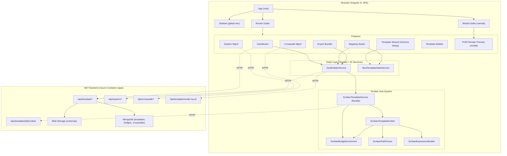
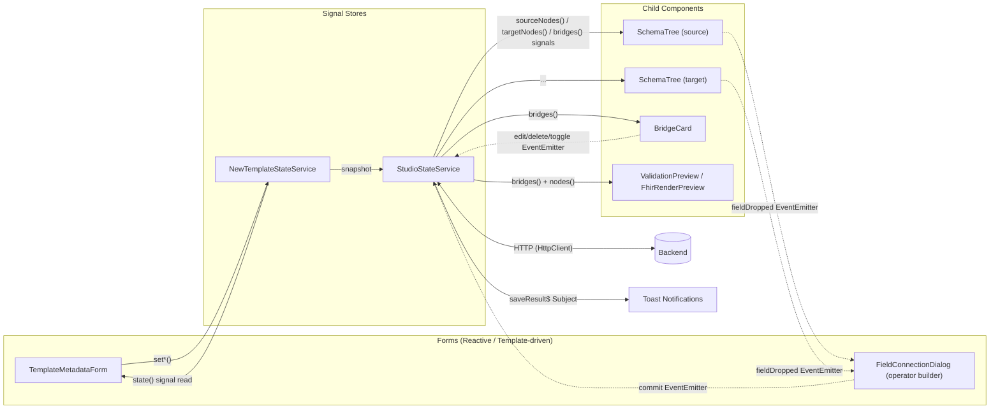
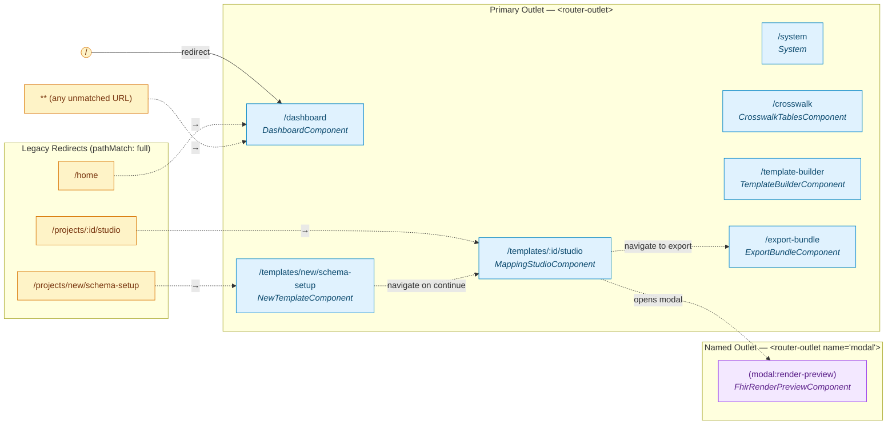

# Angular Project Analysis — `mapping-studio-ui`

> **Repository:** `mapping-studio-ui` (v0.0.0)
> **Framework:** Angular **21.1** (standalone components, signals, no NgModules)
> **TypeScript:** 5.9 (strict mode, `noImplicitOverride`, `noPropertyAccessFromIndexSignature`, `strictTemplates`)
> **UI library:** Angular Material 21.1 + custom CSS
> **Build target:** Docker (multi-stage) → nginx (Azure Container Apps)
> **Domain:** A visual mapping studio for transforming source data schemas (JSON/XML) into target FHIR resources via a Scriban template engine, with crosswalks, rule-sets and value-map dialogs.

---

## Table of Contents

1. [Project Architecture Overview](#1-project-architecture-overview)
2. [Component-Wise Hierarchical Analysis](#2-component-wise-hierarchical-analysis)
3. [Service & Utility Analysis](#3-service--utility-analysis)
4. [Routing Analysis](#4-routing-analysis)
5. [State Management](#5-state-management)
6. [Unused / Dead Code Detection](#6-unused--dead-code-detection)
7. [Code Quality & Best Practices](#7-code-quality--best-practices)
8. [Performance & Security Insights](#8-performance--security-insights)
9. [Summary & Recommendations](#9-summary--recommendations)

---

## 1. Project Architecture Overview

### 1.1 High-Level Architecture



### 1.2 Module Structure (Modern Standalone)

The project uses **Angular 21 standalone components only** — there is no `AppModule`, no `SharedModule`, no `CoreModule`. Bootstrapping is done in `src/main.ts` via `bootstrapApplication(App, appConfig)`. The `appConfig` (`src/app/app.config.ts`) provides:

- `provideBrowserGlobalErrorListeners()`
- `provideRouter(routes)`
- `provideAnimations()`
- `provideHttpClient(withInterceptorsFromDi())`

All components declare their dependencies via the `imports: []` array. Services use `@Injectable({ providedIn: 'root' })`, giving a single application-wide singleton tree.

Folder layout (`src/app/`):

```
src/app/
├── app.ts / app.html / app.css   # Root component (shell + sidebar visibility)
├── app.config.ts                 # bootstrap providers
├── app.routes.ts                 # ALL routes in ONE file (no lazy loading)
├── core/
│   └── layout/
│       ├── header/               # ⚠ DEAD CODE (declared, never used)
│       └── sidebar/              # Global nav
├── features/
│   ├── dashboard/                # Landing page (templates list + stats)
│   ├── crosswalk/                # Crosswalk CRUD
│   ├── system/                   # Source/target system CRUD
│   ├── template-builder/         # Standalone Scriban template editor
│   ├── template-wizard/          # Step 1 — schema setup wizard
│   ├── mapping-studio/           # Step 2 — drag-drop bridge editor (LARGEST feature)
│   │   ├── bridge-card/
│   │   ├── bridge-editor/        # ⚠ Largely superseded by field-connection-dialog
│   │   ├── field-connection-dialog/  # Massive — 1864 lines
│   │   ├── fhir-render-preview/  # Modal render preview
│   │   ├── schema-tree/          # Drag-drop source/target tree
│   │   └── validation-preview/   # Scriban template generation/preview (819 lines)
│   └── export-bundle/            # Step 3 — zip export
├── shared/                       # Presentational components (stepper, status-badge, etc.)
├── models/                       # TS interfaces (studio, template, crosswalk)
├── services/                     # 19 root-singleton services (~6,500 LOC)
└── utils/                        # 6 pure utility files (~3,400 LOC)
```

### 1.3 Dependency Flow & Lazy Loading

- **No lazy loading.** Every route component is `import`-ed eagerly at the top of `app.routes.ts`. This produces a single large initial bundle. For a multi-section app of this size (the largest feature is well over 100 kB of TypeScript alone) lazy-loading the wizard, mapping studio, system, crosswalk, template-builder and export sections is a strong win.
- **Service injection** is uniformly `providedIn: 'root'`. Every service is a singleton; lifecycle-scoped or component-scoped providers are not used anywhere.
- **Module-to-module imports** are not relevant (no NgModules). Components import each other directly through the standalone `imports` array; services come through constructor or `inject()`.

### 1.4 Backend Interaction

- **Base URL** is resolved at runtime from `window.__env.API_URL` (overwritten in `public/env.js` by `docker-entrypoint.sh` at container startup). Build-time `environment.*.ts` files only supply a fallback. This is a clean "build once, deploy anywhere" pattern.
- **HTTP endpoints** used by the app (grouped by service):

| Service | Endpoints |
|---|---|
| `DashboardService` | `GET /system`, `GET /crosswalk`, `GET /template`, `DELETE/POST /template/{id}/duplicate`, `GET /template/{id}/export` |
| `StudioStateService` | `GET/POST/PUT /template`, `GET /template/{id}/schemas`, `POST /template/render-by-id` |
| `ScribanTemplateService` | `POST /template/{id}/scriban`, `GET /template/{id}/scriban`, `GET /template/{id}/scriban/versions`, `GET /template/{id}/scriban/{version}` |
| `CrosswalkService` | `GET/POST/PUT/DELETE /crosswalk(/{id})` |
| `SystemService` | `GET/POST/PUT /system(/{name})`, soft-delete |
| `ExportBundleService` | Composes a zip from `StudioStateService` + crosswalk/system fetches |

- **No `HttpInterceptor`** is registered. `withInterceptorsFromDi()` is wired but nothing is provided — no auth header, no error logging, no retry except an ad-hoc `retry({count: 1})` in `CrosswalkService`.

---

## 2. Component-Wise Hierarchical Analysis

### 2.1 Component Tree

```mermaid
flowchart TD
    APP["App (root)"] --> SIDEBAR["Sidebar"]
    APP --> RO["router-outlet"]
    APP --> MO["router-outlet name=modal"]

    RO --> DASH["DashboardComponent"]
    DASH --> DEL_TPL["DeleteTemplateDialogComponent"]

    RO --> NEW["NewTemplateComponent (wizard)"]
    NEW --> STEPPER1["StepperComponent"]
    NEW --> TMF["TemplateMetadataFormComponent"]
    TMF --> SUD["SchemaUploadDialogComponent"]

    RO --> MS["MappingStudioComponent"]
    MS --> STEPPER2["StepperComponent"]
    MS --> ST_SRC["SchemaTreeComponent (source)"]
    MS --> ST_TGT["SchemaTreeComponent (target)"]
    MS --> BC["BridgeCardComponent *ngFor"]
    MS --> BE["BridgeEditorComponent"]
    MS --> FCD["FieldConnectionDialogComponent"]
    MS --> VP["ValidationPreviewComponent"]
    MS --> CD["ConfirmDialogComponent (via MatDialog)"]

    MO --> FRP["FhirRenderPreviewComponent"]

    RO --> EB["ExportBundleComponent"]
    EB --> STEPPER3["StepperComponent"]

    RO --> SYS["System"]
    SYS --> SCARD["SystemCardComponent *ngFor"]
    SYS --> RSYS["RegisterSystemDialogComponent (via MatDialog)"]
    SYS --> DSYS["DeleteSystemDialogComponent (via MatDialog)"]

    RO --> CWT["CrosswalkTablesComponent"]
    CWT --> CCARD["CrosswalkCardComponent *ngFor"]
    CWT --> CCD["CrosswalkCreateDialogComponent (via MatDialog)"]
    CWT --> DCD["DeleteCrosswalkDialogComponent (via MatDialog)"]

    RO --> TB["TemplateBuilderComponent"]

    HDR["Header (UNUSED — dead code)"]
```



### 2.2 Responsibilities, Inputs/Outputs & Usage

The tables below enumerate every component (28 in total — 1 root, 1 layout, 5 shared, 21 feature).

#### Root & Layout

| Component | File | I/O | Used By | Responsibility |
|---|---|---|---|---|
| `App` | `app.ts` | — | bootstrap | Shell. Computes `showSidebar` signal from `NavigationEnd` events; renders `<app-sidebar>` only on `/dashboard`, `/system`, `/crosswalk`, `/template-builder`. Hosts the primary and `modal` named router outlet. |
| `Sidebar` | `core/layout/sidebar/sidebar.ts` | — | `App` | Static nav (uses only `RouterLink` + `RouterLinkActive`). Zero logic. |
| `Header` | `core/layout/header/header.ts` | — | **NOBODY** | Declared with selector `app-header`, has a `goToNewTemplate()` method — but **no template references `<app-header>` anywhere**. Dead. |

#### Shared Presentational Components (`src/app/shared/`)

| Component | Selector | Inputs | Outputs | Consumers |
|---|---|---|---|---|
| `StepperComponent` | `app-stepper` | `steps: StepperStep[]` | `stepClick: EventEmitter<{step, index}>` | `NewTemplateComponent`, `MappingStudioComponent`, `ExportBundleComponent` |
| `StatusBadge` | `app-status-badge` | `status: 'COMPLETED'\|'INPROGRESS'` | — | **NOBODY** — referenced in no template (dead) |
| `TagBadge` | `app-tag-badge` | `label: string` | — | **NOBODY** — dead |
| `ProgressBar` | `app-progress-bar` | `value: number` | — | **NOBODY** — dead (Material `MatProgressBarModule` is used instead in dashboard) |
| `ConfirmDialogComponent` | `app-confirm-dialog` | (`MAT_DIALOG_DATA` injection) | dialogRef close result | `MappingStudioComponent` (delete bridge / leave studio / reset all) |

#### Dashboard

| Component | I/O | Usage | Notes |
|---|---|---|---|
| `DashboardComponent` | — | route `/dashboard` (default) | Landing page. Uses signals (`search`, `isLoading`, `allProjects`, `stats`, `showAllMappings`) with `computed()` for filtered mappings and total count. Calls `DashboardService.getDashboardData()`. Loads first 10 results unless "View all" clicked. Has duplicate filtering logic in `mappings` and `displayedMappingsCount` (DRY violation). |
| `DeleteTemplateDialogComponent` | injected `data: {templateName}` | dashboard delete action | Returns boolean confirmation. |

#### Template Wizard (Step 1)

| Component | I/O | Usage |
|---|---|---|
| `NewTemplateComponent` | — | route `/templates/new/schema-setup`. Hosts stepper + metadata form, navigates to `/templates/{uuid}/studio` on continue. Detects edit mode via `?templateId=` query param and hydrates `NewTemplateStateService` from backend. |
| `TemplateMetadataFormComponent` | `@Output titleChange`, `descriptionChange`, `validChange` | child of `NewTemplateComponent` | Reactive form with title/description/sourceSystem/targetSystem + 2 schema uploads (source & target). Uses `MatDialog` to open `SchemaUploadDialogComponent`. Persists into `NewTemplateStateService` (signal-based store). |
| `SchemaUploadDialogComponent` | `MAT_DIALOG_DATA: SchemaUploadDialogConfig` | invoked by metadata form | Either uploads a file or picks a FHIR resource type. Returns an `UploadedSchema` to caller. Uses `FhirSchemaLoaderService`. |

#### Mapping Studio (Step 2)

| Component | I/O | Usage | Notes |
|---|---|---|---|
| `MappingStudioComponent` | route param `id`, query param `edit` | route `/templates/:id/studio` | The hub. Orchestrates source/target trees, bridge list, connection dialog, validation preview, dialog confirmations, and persistence via `StudioStateService`. Has four init branches (`_handleEditMode` / `_handleNewTemplateFromWizard` / `_handleDirectInitialization` / redirect). Manages drag-drop on a "canvas" zone. |
| `SchemaTreeComponent` | `nodes`, `mode: 'source'\|'target'`, `searchQuery`, `mappedPaths`; `@Output fieldDropped`, `configureConnection` | child of MappingStudio (twice — once per side) | Custom tree with flattening, expand/collapse cache, native HTML5 drag-drop, search highlight. **Direct DOM manipulation** through `event.dataTransfer`. |
| `BridgeCardComponent` | `bridge`, `liveValidation`, `sourceNodes`, `targetNodes`, `availableCrosswalks`, `crosswalkLoadError`; `@Output edit`, `delete`, `toggle`, `exportBundle` | rendered `*ngFor` in MappingStudio | Shows one bridge's status, transform summary, condition groups; rehydrates "operator summary" from stored params. |
| `BridgeEditorComponent` | `bridge`; `@Output save`, `close` | MappingStudio | A simpler inline editor for transform parameters. **Mostly superseded** by `FieldConnectionDialogComponent` — see "Dead code" below. |
| `FieldConnectionDialogComponent` | `sourcePath`, `targetPath`, `sourceNodes`, `targetNodes`, `selectedTransform`, `existingBridge`; `@Output commit`, `close` | MappingStudio | **1864-line component** — handles one-to-one / many-to-one / one-to-many / many-to-many patterns, RuleSet selection, Crosswalk selection, value-map rules (operators: equals, contains, in, matches, etc.), Scriban operator catalog. Largest single file in the project. |
| `ValidationPreviewComponent` | `bridges`, `sourceFormat`, `targetFormat`, `title`, `templateId`, `sourceNodes`, `targetNodes`; `@Output close` | MappingStudio | 819 LOC. Generates Scriban template via `convertTemplateJsonToScriban()` + `ScribanTemplateService`, supports edit mode, "Viva" preview, save/list/load versions, syntax highlight via `DomSanitizer.bypassSecurityTrustHtml` (commented "safe because…"). |
| `FhirRenderPreviewComponent` | — | route `(modal:render-preview)` — named outlet | Renders backend output by posting source JSON to `/template/render-by-id`. Debounces source-JSON edits 800 ms via `Subject` + `debounceTime`. |

#### Export Bundle (Step 3)

| Component | I/O | Usage |
|---|---|---|
| `ExportBundleComponent` | — | route `/export-bundle` | Final step. Reads `StudioStateService`, calls `ExportBundleService.downloadBundle()` (`fflate` zip), marks template `COMPLETED`. |

#### Crosswalk

| Component | I/O | Usage |
|---|---|---|
| `CrosswalkTablesComponent` | — | route `/crosswalk` | Lists crosswalks. Sorts by `updatedAt` / `createdAt`. Forks system + crosswalk fetches. Reconciles camelCase vs PascalCase from .NET backend. |
| `CrosswalkCardComponent` | `crosswalk` etc., outputs edit/delete | child of CrosswalkTables | Card UI per crosswalk. |
| `CrosswalkCreateDialogComponent` | DATA | opened by parent | Create/edit dialog. Long form. |
| `DeleteCrosswalkDialogComponent` | DATA | parent | Delete confirmation. |

#### System

| Component | I/O | Usage |
|---|---|---|
| `System` | — | route `/system` | Systems CRUD list with manual pagination (6/page). Caches page numbers (`_totalPages`, `_pageNumbers`) to avoid recomputation. |
| `SystemCardComponent` | `system: SystemModel`; outputs edit/delete | child | One card per system. |
| `RegisterSystemDialogComponent` | DATA `{editMode, system?}` | parent | Create/edit. |
| `DeleteSystemDialogComponent` | DATA `{systemName, systemType}` | parent | Delete confirmation. |

#### Template Builder

| Component | I/O | Usage |
|---|---|---|
| `TemplateBuilderComponent` | — | route `/template-builder` | A second, parallel template editor (raw Scriban + crosswalk/ruleset snippets). Uses `@ViewChild('templateEditor') templateEditor: ElementRef` and **directly mutates a `<textarea>` via `nativeElement.selectionStart/End`**. This is the most explicit direct DOM manipulation in the codebase and is the cleanest candidate for refactor to a Material `MatFormField` + `FormControl` or CodeMirror integration. |

### 2.3 Data Flow



**Cross-component communication mechanisms used:**

- `@Input() / @Output(EventEmitter)` — every parent/child pair (`BridgeCard`, `SchemaTree`, `BridgeEditor`, `FieldConnectionDialog`, …)
- **Angular Signals (`signal`, `computed`, `asReadonly`)** as the primary cross-component state mechanism. `StudioStateService` exposes ~15 read-only signals and components read them directly in templates.
- **RxJS `Subject`** in `StudioStateService.saveResult$` for "save complete" events (the single notification stream), and in `FhirRenderPreviewComponent` (debounced re-render).
- `MatDialog` for modal dialogs (return values via `dialogRef.afterClosed()`).
- **NgRx, ComponentStore, Akita, etc. are NOT used.**

---

## 3. Service & Utility Analysis

### 3.1 Service Inventory (19 services, all `providedIn: 'root'`)

| Service | LOC | Consumed By | Purpose | Status |
|---|---:|---|---|---|
| `StudioStateService` | 1123 | MappingStudio, FhirRenderPreview, ExportBundle, NewTemplate, ValidationPreview | **Core orchestration store.** Holds signals for bridges, nodes, schemas, format, system, version, status. CRUD on bridges, save/load to backend, coverage computation, validation. | ⚠ Very large — split candidate |
| `NewTemplateStateService` | 123 | NewTemplate, TemplateMetadataForm, MappingStudio | Small signal store for the wizard's draft state before it migrates into `StudioStateService`. | ✓ |
| `ScribanTemplateService` | 402 | StudioState, ValidationPreview, FhirRenderPreview (transitively) | **Facade** over the 4 Scriban sub-services. Also owns streaming-fetch transform pipeline. | ✓ |
| `ScribanTemplateEmitterService` | 829 | ScribanTemplateService | Emits Scriban text from bridges (single/multi-collection, multi-record-type). | ⚠ Large |
| `ScribanExpressionBuilderService` | 461 | ScribanTemplateService, Emitter | Builds individual Scriban expressions, applies pipes. | ✓ |
| `ScribanBridgeEnrichmentService` | 287 | ScribanTemplateService, Emitter | Normalizes bridges into a richer form for code generation. | ✓ |
| `ScribanPathParserService` | 185 | ScribanTemplateService, Emitter | Parses source/target paths into segments and loops. | ✓ |
| `ScribanTransformPreviewService` | ~150 | ScribanTemplateService | Helpers for preview generation. | ✓ |
| `BridgeNormalizationService` | 347 | StudioState | Normalizes raw backend bridges into the UI `Bridge` model. | ✓ |
| `DashboardService` | 308 | Dashboard | forkJoin on `/system` + `/crosswalk` + `/template`; computes stats & coverage. | ⚠ Coverage fallback should not ship — verbose `console.warn` on every load. |
| `SystemService` | 416 | System feature, TemplateBuilder, ExportBundle | CRUD + soft-delete. Has built-in fallback to `MOCK_SYSTEMS` if backend is down. | ⚠ Mock-data fallback in prod path |
| `CrosswalkService` | 256 | Crosswalk feature, MappingStudio, TemplateBuilder, FieldConnectionDialog | CRUD with conflict detection. Has retry(1) for network errors. | ✓ |
| `FhirSchemaLoaderService` | 608 | SchemaUploadDialog | Loads the bundled `docs/fhir.schema.json` (3.3 MB) to populate FHIR resource trees. | ✓ |
| `ExportBundleService` | 249 | ExportBundle | Composes the final zip via `fflate`. | ✓ |
| `FhirPreviewService` (`mapping-studio/validation-preview/`) | ~700 | ValidationPreview | Local Scriban renderer used by validation panel. Lives in feature folder, not `services/` — inconsistent location. | ⚠ Inconsistent placement |
| `RuleSetService` (`ruleset.service.ts`) | 19 | TemplateBuilder, FieldConnectionDialog | **Deprecation stub.** Returns empty arrays/null with `@deprecated` JSDoc; "legacy components" still inject it. | ⚠ Stub — finish removal |
| `RuleEngineService` (`rule-engine.service.ts`) | 255 | **NONE** | Pure interfaces + class, but no component or service imports it. | ✗ Dead code |
| `ScribanUtilityService` | 167 | **NONE** (only referenced in a comment in rule-engine.service.ts) | Unused. | ✗ Dead code |
| `TemplateValidationService` | ~150 | **NONE** | Unused. | ✗ Dead code |

> **Note:** A `MOCK_SYSTEMS` constant in `services/mock-systems.data.ts` is wired into the production `SystemService.getAllSystems()` and `getSystemsByType()` paths as a fallback when the backend errors. This silently masks backend outages and pollutes production data with demo records.

### 3.2 Utilities (`src/app/utils/`)

| File | LOC | Exports | Used By |
|---|---:|---|---|
| `template-to-scriban.util.ts` | 1270 | `convertTemplateJsonToScriban`, `TemplateJsonInput` | ValidationPreview | **Massive utility file** — should be split or moved into a service. |
| `schema-to-nodes.util.ts` | 843 | `schemaToNodes` | MappingStudio | Converts uploaded schema text to the internal `SchemaNode[]` tree. |
| `schema-parse.util.ts` | 463 | various parsers | schema-to-nodes |
| `path-context.util.ts` | 382 | `resolvePathContext`, `resolvePathContextFromString`, `inferFhirResourceType`, `isPathTypeCompatible` | BridgeCard, FieldConnectionDialog, validation.util |
| `validation.util.ts` | 205 | `validateBridge`, `validateBridgeSet`, `findRequiredUnmappedFields`, `suggestTransformKind`, `findConflictingBridges` | StudioState |
| `date-format.util.ts` | ~30 | `dotnetToStrftime` | FieldConnectionDialog |

There are **no custom Angular directives or pipes** anywhere in the codebase.

### 3.3 Shared Resources

- **Material modules** are imported per-component (`MatDialogModule`, `MatIconModule`, `MatCardModule`, `MatSnackBarModule`, …) rather than re-exported from a shared barrel. This is fine for standalone but means each large feature component lists 10-15 imports.
- **`CommonModule`** is imported by ~half the components even though Angular 21 provides `@if`/`@for` natively. Many components could drop `CommonModule` once they migrate from `*ngIf`/`*ngFor`. (E.g. `app.html` already uses the new `@if` syntax — proof the rest can too.)

---

## 4. Routing Analysis

### 4.1 Routing Tree



### 4.1.1 Routing Tree (ASCII Alternative)

```
Application Routes (src/app/app.routes.ts)
│
├── Primary Outlet  ──  <router-outlet>
│   │
│   ├── /                              ──►  redirectTo: 'dashboard' (pathMatch: 'full')
│   │
│   ├── /dashboard                     ──►  DashboardComponent           [DEFAULT LANDING]
│   ├── /system                        ──►  System
│   ├── /crosswalk                     ──►  CrosswalkTablesComponent
│   ├── /template-builder              ──►  TemplateBuilderComponent
│   ├── /export-bundle                 ──►  ExportBundleComponent
│   │
│   ├── /templates/new/schema-setup    ──►  NewTemplateComponent          (Wizard Step 1)
│   └── /templates/:id/studio          ──►  MappingStudioComponent        (Wizard Step 2)
│
├── Named Outlet  ──  <router-outlet name="modal">
│   │
│   └── (modal:render-preview)         ──►  FhirRenderPreviewComponent    [outlet: 'modal']
│
├── Legacy Aliases  (redirectTo, pathMatch: 'full')
│   │
│   ├── /home                          ──►  /dashboard
│   ├── /projects/new/schema-setup     ──►  /templates/new/schema-setup
│   └── /projects/:id/studio           ──►  /templates/:id/studio
│
└── Wildcard
    │
    └── **                             ──►  redirectTo: 'dashboard'


User Flow (in-app navigation, not config):

  /dashboard
      │
      ├── click "New Template"  ──►  /templates/new/schema-setup
      │                                        │
      │                                        │ continueToMapping()
      │                                        ▼
      │                              /templates/{uuid}/studio
      │                                        │
      │                                        ├── opens modal:  router.navigate([{outlets:{modal:['render-preview']}}])
      │                                        │
      │                                        │ goToExportBundle()
      │                                        ▼
      │                                  /export-bundle
      │
      └── click template row    ──►  /templates/{id}/studio?edit=true
```

### 4.1.2 Routing Summary

| Property | Value |
|---|---|
| Total route definitions | **12** |
| Primary-outlet routes | 7 (5 simple + 2 wizard) |
| Named-outlet routes | 1 (`modal`) |
| Redirects (incl. wildcard) | 5 |
| Lazy-loaded routes | **0** — all components are statically imported |
| Route guards (`canActivate`, `canDeactivate`, `canMatch`, `resolve`) | **None** |
| Route params | `:id` (Mapping Studio template ID) |
| Query params used | `?edit=true` (edit mode), `?templateId=…` (wizard hydration) |

### 4.2 Configuration

All routes live in **a single file**, `src/app/app.routes.ts`. None are lazy-loaded; every component is imported at the top, so the initial bundle holds the entire app.

The `FhirRenderPreviewComponent` uses a **named outlet** (`outlet: 'modal'`) defined inside `app.html` as `<router-outlet name="modal"></router-outlet>`. The Mapping Studio toggles it with `this.router.navigate([{ outlets: { modal: ['render-preview'] } }])`. This is an elegant pattern for a modal that can be deep-linked.

### 4.3 Route Guards, Resolvers, Interceptors

- **No `CanActivate`, `CanDeactivate`, `CanMatch`, or `Resolve` guards exist.** Notable consequence: `MappingStudioComponent.goBack()` rolls its own unsaved-changes dialog. A `CanDeactivate` guard would be more idiomatic and re-usable.
- **No `HttpInterceptor` is provided.** `provideHttpClient(withInterceptorsFromDi())` is configured but no interceptors are registered. There is therefore no app-wide auth header, no centralized error handler, no telemetry on requests.

---

## 5. State Management

The application uses a **signal-based store pattern** built on Angular's native primitives:

- **`signal<T>()`** — private writable state inside a service
- **`computed()`** — derived state (e.g. `editingBridge`, `bridgeCount`, `hasUnsavedChanges`, `isValid`)
- **`.asReadonly()`** — public, read-only handles exposed to components
- **RxJS `Subject`** — for one-shot save-result notifications (`saveResult$`) and debounced inputs (`_sourceChange$`)
- **Component-local signals** — `DashboardComponent` (`search`, `isLoading`, `showAllMappings`, `allProjects`, `stats`) and `App` (`currentUrl`, `showSidebar`).

There is **no NgRx, no `@ngrx/signals` SignalStore, no NGXS, no Akita, no `BehaviorSubject`-based store**, and no use of `Resolver`. The pattern resembles a hand-rolled "Signal Store":

```ts
// StudioStateService
private _bridges = signal<Bridge[]>([]);         // writable, private
readonly bridges = this._bridges.asReadonly();    // public read
readonly bridgeCount = computed(() => this._bridges().length);

addBridge(src, tgt) { this._bridges.update(b => [...b, {…}]); }
```

**Strengths**

- Lightweight, no extra dependencies.
- Type-safe end-to-end.
- Auto-tracks dependencies; templates re-render on signal change without `async` pipe or manual `markForCheck()`.

**Weaknesses**

- No time-travel debugging, no devtools.
- `StudioStateService` is 1,123 LOC — three concerns are mixed in one class (mutations + persistence + HTTP). NgRx-style separation (or even just splitting into `StudioStore` + `StudioApiService`) would help.
- No reactive *outputs* — components depending on save events have to subscribe to `saveResult$` and remember to unsubscribe.

---

## 6. Unused / Dead Code Detection

### 6.1 Unused Components

| File | Selector | Evidence |
|---|---|---|
| `core/layout/header/header.ts` + `.html` + `.css` | `app-header` | `grep` for `<app-header` across the codebase returns **only the definition**. The `goToNewTemplate()` method is never invoked. |
| `shared/status-badge/status-badge.ts` + `.html` + `.css` | `app-status-badge` | Not referenced in any template. |
| `shared/tag-badge/tag-badge.ts` + `.html` + `.css` | `app-tag-badge` | Not referenced in any template. |
| `shared/progress-bar/progress-bar.ts` + `.html` + `.css` | `app-progress-bar` | Not referenced; the dashboard uses Material's `mat-progress-bar` instead. |

### 6.2 Unused Services

| File | Evidence |
|---|---|
| `services/rule-engine.service.ts` (255 LOC) | The only reference to `RuleEngineService` outside the file is a spec file. No component or runtime service injects it. |
| `services/scriban-utility.service.ts` (167 LOC) | The class `ScribanUtilityService` is mentioned only inside a code comment in `rule-engine.service.ts`. Never injected. |
| `services/template-validation.service.ts` (~150 LOC) | `TemplateValidationService` is exported but never imported. |

### 6.3 Stubbed / Deprecated Services Still Injected

| File | Status | Action |
|---|---|---|
| `services/ruleset.service.ts` | The class itself is annotated `@deprecated` and its two methods return `of([])` / `of(null)`. Still injected by `TemplateBuilderComponent` and `FieldConnectionDialogComponent`. | Finish removal: drop both injections, delete the file, and audit `FieldConnectionDialog` for the "RuleSet" UI fragments (`availableRuleSets`, `selectedRuleSetIds`, etc.) that depend on these calls. |

### 6.4 Partially Superseded Components

| Component | Notes |
|---|---|
| `BridgeEditorComponent` (`mapping-studio/bridge-editor/bridge-editor.ts`) | Provides a simple transform-kind editor with 5 transform options. The newer `FieldConnectionDialogComponent` covers the same use-cases (and more). `BridgeEditor` is still imported and conditionally rendered in `mapping-studio.html` (`*ngIf="studio.editingBridge() as bridge"`) but the actual user flow now routes through `FieldConnectionDialog`. Decide which is canonical and remove the other. |

### 6.5 Other Dead / Suspect Code

- **Commented-out stat tiles** in `DashboardComponent.statTiles` (Crosswalk, Rule Sets) suggest features that were removed. Delete the comments.
- **Many `console.log/info/debug/warn/group`** statements ship in production code (103 calls outside spec files). Notable offenders: `MappingStudioComponent.ngOnInit` ("🆕 NEW TEMPLATE: …"), `DashboardComponent.loadDashboardData` (a whole `console.group` analytics block), `StudioStateService` save/load, `DashboardService.computeCoverage` (`console.warn` on every template).
- **Aliased routes** `/home`, `/projects/new/schema-setup`, `/projects/:id/studio` exist purely for backward compatibility. If the project has no public users hitting old URLs, drop them.
- **Backward-compatible export** in `template.models.ts`: `export type NewProjectState = NewTemplateState;` — verify nothing imports `NewProjectState` and remove.
- **`environment.prod.ts` vs `environment.production.ts`** — two production environment files exist (`prod` is the one referenced from `angular.json`); `production.ts` is unreferenced. Delete it.

### 6.6 Safe Removal Plan

```text
1. (Trivial) Delete unused presentational components — no consumers:
   - core/layout/header/
   - shared/status-badge/
   - shared/tag-badge/
   - shared/progress-bar/

2. Delete unused services + their spec files:
   - services/rule-engine.service.ts (+ services/spec/rule-engine.service.spec.ts)
   - services/scriban-utility.service.ts (+ spec)
   - services/template-validation.service.ts (+ spec)
   - environments/environment.production.ts

3. Finalize deprecation of RuleSet:
   - In FieldConnectionDialogComponent and TemplateBuilderComponent: remove ruleSetService injection
     and the related UI state. After cleanup, delete services/ruleset.service.ts.

4. Decide on BridgeEditor vs FieldConnectionDialog:
   - Keep ONE editor surface; delete the other and its template/CSS/spec.

5. Strip diagnostic logging — replace ad-hoc console.* with a real logger,
   or guard with `if (!environment.production)`.

6. Delete the alias routes once Analytics confirms no traffic hits them.
```

---

## 7. Code Quality & Best Practices

### 7.1 Folder Structure & Angular Style Guide

| Aspect | Verdict |
|---|---|
| `feature/` folder per route | ✓ Followed |
| `shared/` for presentational widgets | ✓ Followed |
| `core/` for layout | ✓ Followed |
| `services/` and `models/` as siblings of `features/` | ✓ Followed |
| **One service-class per file** | ✓ Followed |
| **One component per folder** with `.ts`, `.html`, `.css`/`.scss`, `.spec.ts` | ✓ Followed |
| **File naming consistent** | ⚠ Mixed — some components use `xxx.component.ts` (`dashboard.component.ts`, `template-builder.component.ts`, `export-bundle.component.ts`, dialog components) and others drop the suffix (`mapping-studio.ts`, `system.ts`, `bridge-card.ts`, `new-template.ts`, `sidebar.ts`). Pick one (Angular's official guide is now optional on the `.component` suffix, but pick one and stick to it). |
| **Class naming consistent** | ⚠ Mixed — `MappingStudioComponent` and `System` (note: no suffix). The bare class name `System` collides conceptually with the `System` interface in `system.service.ts`, which is currently aliased as `SystemModel` everywhere it's imported. |
| **CSS naming** | ⚠ Mixed — some folders use `.css`, dashboard/crosswalk/template-builder use `.scss`. Pick one. |

### 7.2 TypeScript Strictness

`tsconfig.json` is excellent: `strict: true`, `noImplicitOverride`, `noPropertyAccessFromIndexSignature`, `noImplicitReturns`, `noFallthroughCasesInSwitch`, plus Angular template strict flags. This is a strong baseline.

**However:** `any` appears **197 times** in non-spec TypeScript files. The hotspots are the backend-shape mapping layers (`BridgeNormalizationService`, `DashboardService._unwrapResponse`, `StudioStateService._mapBackendBridgeToBridge`) where the .NET payload is unpredictable. Replace with `unknown` + type-narrowing helpers, or define `BackendTemplateRaw`/`BackendBridgeRaw` types that mirror the actual server response.

Patterns seen frequently:

```ts
private _mapBackendBridgeToBridge(b: any): Bridge { /* 20 lines of property fallbacks */ }
return (this.stateService.state() as any).source || null;  // template-metadata-form.ts
```

Most of these can be replaced with discriminated unions or explicit response types.

### 7.3 Bad Patterns Observed

1. **Direct DOM manipulation** in `TemplateBuilderComponent.insertSnippet`:
   ```ts
   const textarea = this.templateEditor?.nativeElement;
   const start = textarea.selectionStart; const end = textarea.selectionEnd;
   …
   textarea.setSelectionRange(start + code.length, start + code.length);
   ```
   This is the largest red flag. Move to a `Renderer2`-based approach, a `FormControl` with caret-tracking, or a real editor (CodeMirror/Monaco).

2. **`window.URL.createObjectURL` + `document.createElement('a')` + `.click()`** appears 4× (Dashboard, ExportBundle, ValidationPreview, TemplateBuilder) and should be extracted into a small `FileDownloadService` to centralize URL revocation and SSR safety.

3. **Hardcoded fallback URLs** in `environment.dev.ts`, `environment.prod.ts`, `environment.qa.ts` (`https://tiestemplateengine.bluewave-…azurecontainerapps.io/api`). Public Azure subdomains exposed in the repo are not secret — but they're fragile (any region/rotation breaks dev builds) and they make it harder to spot mis-configured deployments. The `production.ts` model (empty string → `window.__env`) is the right pattern.

4. **Coverage logic duplication.** `DashboardService._unwrapResponse` and `DashboardComponent.mappings/displayedMappingsCount` both implement filtering twice; consolidate into one `computed()`.

5. **Toast-by-`setTimeout`** in `MappingStudioComponent._showToast` — uses a 3-second `setTimeout` to clear a signal. The timer ID isn't stored, so rapid toasts overlap. Use `MatSnackBar` consistently (the rest of the app already does).

6. **Console statements left in shipping code** (103 outside specs). Strip via a build-time transform or by introducing a `LoggerService`.

7. **Unsubscribed subscriptions.** 54 `.subscribe(` calls in non-spec TS files, but only 6 mentions of `takeUntilDestroyed`/`takeUntil`/`ngOnDestroy`. The codebase relies on the HTTP observables completing themselves. See §8.2.

8. **Naming collisions.** `System` is both the component class (`system.ts`) and the model interface (`system.service.ts`). Every consumer aliases the interface as `SystemModel`. Rename one (e.g. component → `SystemListComponent`).

---

## 8. Performance & Security Insights

### 8.1 Change Detection

- **Zero components use `ChangeDetectionStrategy.OnPush`.** Combined with default zone.js change detection (no `provideZonelessChangeDetection()` either), every HTTP response, click, and timer triggers a full app CD pass. For a workbench-class app with a 1,800-line dialog and large schema trees, switching feature components to `OnPush` is one of the highest-ROI changes available.
- Signals already participate in fine-grained tracking, so adopting `OnPush` is mostly mechanical: change `@Component({ … })` to add `changeDetection: ChangeDetectionStrategy.OnPush` and migrate any remaining `EventEmitter`-only flows to signals.
- The app uses `async` pipe… **almost never** (one search showed no `| async` in the templates inspected). HTTP results are `.subscribe()`-ed into signals or fields rather than piped. With OnPush, `async` pipe is the safer default.

### 8.2 Memory-Leak Risks (Unsubscribed Observables)

`subscribe()` count: 54. `takeUntil*` / `ngOnDestroy` count: 6.

Most subscriptions are to `HttpClient` observables which complete after one emit, so they're benign. The ones to **watch**:

- `MappingStudioComponent` subscribes to `studio.saveResult$` and stores the sub in `_saveSub`. `ngOnDestroy` unsubscribes — ✓ good.
- `FhirRenderPreviewComponent._sourceChange$.pipe(debounceTime(800), distinctUntilChanged()).subscribe()` has **no `takeUntilDestroyed` and no `ngOnDestroy`**. Since the component is opened in a named outlet that can be closed/reopened, this is a real leak.
- `App` subscribes to `router.events` in the constructor with **no unsubscribe**. Since `App` lives for the whole app lifetime, this is harmless in practice, but `takeUntilDestroyed(inject(DestroyRef))` would be cleaner.
- `NewTemplateComponent.ngOnInit` subscribes to `route.queryParams` with **no unsubscribe**. ActivatedRoute observables don't auto-complete; this can leak if the component is re-instantiated rapidly.

Recommendation: adopt the modern Angular 16+ pattern uniformly:

```ts
import { takeUntilDestroyed } from '@angular/core/rxjs-interop';
…
this.route.queryParams.pipe(takeUntilDestroyed()).subscribe(…);
```

### 8.3 Bundle Size & Lazy Loading

- All route components are statically imported in `app.routes.ts` → **the whole feature surface is in the initial bundle**.
- `MappingStudio` alone pulls in `FieldConnectionDialog` (1,864 LOC) + `ValidationPreview` (819 LOC) + `FhirRenderPreview` (335 LOC) + many Material modules. Most users will land on `/dashboard`, never open `/templates/:id/studio`, and pay the cost.
- **Recommendation:** convert each top-level route to `loadComponent: () => import('./features/.../X').then(m => m.X)`. This will dramatically reduce initial JavaScript.
- `angular.json` budget is set to 2 MB warning / 4 MB error — generous. Tighten once lazy-loading is in place.
- `docs/fhir.schema.json` is **3.3 MB**. If it's bundled or served as an asset, fetch it lazily from `SchemaUploadDialog`, not at app startup.

### 8.4 Security

| Area | Finding |
|---|---|
| **Sanitization** | `DomSanitizer.bypassSecurityTrustHtml` is used in `ValidationPreviewComponent` and `FhirRenderPreviewComponent`. Both call it on the output of a **local `_syntaxHighlight()` regex**, not on user-supplied HTML. Comments in the code claim it's safe. The risk is moderate — if the highlighter regex is ever fed unsanitized user JSON containing literal `<script>`, escape-then-format is safer (escape first, then wrap spans). |
| **Direct DOM access** | `document.createElement('a')` + `.click()` for downloads is fine but not SSR-safe. If you ever enable Angular Universal/SSR, gate these behind `isPlatformBrowser`. |
| **CSRF / JWT** | No JWT/Bearer token handling, no `Authorization` header. The app assumes the backend is either open or authenticated by the surrounding platform. **There is no `HttpInterceptor` to attach tokens.** If auth is required, add one. |
| **Secrets in source** | No API keys/passwords in source. ✓ |
| **Hardcoded backend URLs** | The `.dev.ts` / `.qa.ts` / `.prod.ts` fallback URLs leak QA/dev hostnames into the public-ish git history. Not secret, but consider replacing with an explicit "set `API_URL` at runtime" assertion. |
| **`nginx.conf` security headers** | `X-Content-Type-Options: nosniff`, `X-Frame-Options: DENY`, `Referrer-Policy: strict-origin-when-cross-origin` are set. ✓ **No `Content-Security-Policy` header** — add one (`default-src 'self'; connect-src 'self' https://*.azurecontainerapps.io; …`). |
| **CORS** | `cors` and `express` are in `dependencies` (not `devDependencies`) but the production Docker image runs nginx + static files only. Move them to `devDependencies` or remove. |
| **`mongoose` dependency** | `"mongoose": "^9.2.4"` is in `dependencies` of an Angular SPA — it's a Node-side ORM and **must not** be in a browser bundle. Remove. |
| **`process.env` / `localStorage` / `sessionStorage`** | None — no PII stored client-side. ✓ |

---

## 9. Summary & Recommendations

### 9.1 Strengths

- Modern Angular 21 stack: standalone components everywhere, signals + computed as the primary state mechanism, no legacy `NgModule` baggage.
- Strict TypeScript & Angular compiler settings — strong baseline.
- Multi-environment Docker pattern with runtime `env.js` injection — build-once-deploy-everywhere is done right.
- Clear separation between feature folders, services, models, utilities.
- Excellent specification of the domain in `docs/` (FHIR, Scriban, .NET integration). Many ADR-style notes inside services and components.
- Heavy test footprint (51 `.spec.ts` files alongside 62 sources — roughly 1:1 source-to-test ratio).
- Sensible nginx config: gzip, cache headers, SPA fallback, security headers.

### 9.2 Top Issues, by Priority

| # | Priority | Theme | Action |
|---|---|---|---|
| 1 | 🔴 **High** | **Lazy load routes** | Convert each top-level route in `app.routes.ts` to `loadComponent`. Expected: large initial-bundle reduction (the Mapping Studio + dialogs alone are well over 100 kB of TS source). |
| 2 | 🔴 **High** | **Remove dead code** | Delete `Header`, `StatusBadge`, `TagBadge`, `ProgressBar` components and `RuleEngineService`, `ScribanUtilityService`, `TemplateValidationService`, `environment.production.ts`. Decide BridgeEditor vs FieldConnectionDialog. (Section 6.6) |
| 3 | 🔴 **High** | **Remove `mongoose` and move `cors`/`express` to devDependencies** | An Angular SPA must never bundle Node-only packages. |
| 4 | 🔴 **High** | **Stop logging in production** | Replace 103 `console.*` calls with a `LoggerService` or strip at build via Angular's optimizer / a custom transformer. Especially: `DashboardService.computeCoverage` warns on **every** template fetched. |
| 5 | 🟡 **Med** | **Adopt `OnPush` on heavy components** | `MappingStudio`, `FieldConnectionDialog`, `ValidationPreview`, `Dashboard`. Combined with signals already in use this is mechanical. |
| 6 | 🟡 **Med** | **Subscription discipline** | Audit the 54 `.subscribe(` calls. Add `takeUntilDestroyed()` to any non-HTTP observable (router events, ActivatedRoute params, Subjects). Specifically: `App.constructor`, `NewTemplateComponent.ngOnInit`, `FhirRenderPreviewComponent.ngOnInit`. |
| 7 | 🟡 **Med** | **Split `StudioStateService`** (1,123 LOC) | Extract HTTP/persistence into `StudioApiService`; keep `StudioStateService` as a pure signal store. Same for `ScribanTemplateEmitterService` (829 LOC) and `template-to-scriban.util.ts` (1,270 LOC). |
| 8 | 🟡 **Med** | **Replace `any` with typed shapes** | 197 occurrences. Define `BackendTemplateRaw`, `BackendBridgeRaw`, `BackendCrosswalkRaw` (matching .NET PascalCase or `JsonNamingPolicy.CamelCase`), and parse-into-domain. |
| 9 | 🟡 **Med** | **Add `HttpInterceptor`** | One for auth headers (if applicable), one for centralised error handling + user-facing toast, one for request correlation IDs. The `withInterceptorsFromDi()` plumbing is already in place. |
| 10 | 🟡 **Med** | **Add `CanDeactivate` guard** for `MappingStudio` | Replaces the hand-rolled `ConfirmDialog` in `goBack()` and works for back-button / accidental URL changes too. |
| 11 | 🟢 **Low** | **Naming consistency** | Rename `System` component to `SystemListComponent` (collides with `System` interface). Pick `.component.ts` suffix or drop it everywhere. Pick `.css` or `.scss`. |
| 12 | 🟢 **Low** | **Drop `CommonModule`** in favour of new control-flow (`@if`, `@for`) — `app.html` already shows this works. |
| 13 | 🟢 **Low** | **Replace direct DOM textarea manipulation** in `TemplateBuilderComponent.insertSnippet` with `Renderer2` or a real editor. |
| 14 | 🟢 **Low** | **Move `FhirPreviewService`** out of `features/mapping-studio/validation-preview/` into `services/` for consistency. |
| 15 | 🟢 **Low** | **Add a `Content-Security-Policy`** header in `nginx.conf` (`default-src 'self'; connect-src 'self' https://*.azurecontainerapps.io;`). |
| 16 | 🟢 **Low** | **Remove `SystemService` mock fallback** | Production code shouldn't silently fall back to demo data when the backend is down. Surface the failure via a toast and an empty state. |

### 9.3 Suggested 30-Day Improvement Plan

```text
Week 1 — Cleanup
  • Delete dead components, services, environment files (Section 6.6).
  • Move mongoose/cors/express out of dependencies.
  • Strip console logging; introduce LoggerService.

Week 2 — Architecture
  • Add lazy loading to all top-level routes.
  • Split StudioStateService into store + api service.
  • Introduce a single FileDownloadService.

Week 3 — Performance & Safety
  • Adopt OnPush in the four heaviest components.
  • Add takeUntilDestroyed() to all non-HTTP subscriptions.
  • Add HttpInterceptor(s): auth + error.
  • Add CanDeactivate guard for the studio.

Week 4 — Type Safety & Polish
  • Define backend response types; remove most `any`.
  • Pick a single component-naming convention and rename.
  • Add CSP header in nginx.conf.
  • Remove SystemService mock fallback.
  • Drop CommonModule where new control flow suffices.
```

### 9.4 Architectural Note

The Scriban sub-system (`ScribanTemplateService` facade + 4 sub-services + utilities) is the most polished part of the codebase: clear single-responsibility services, a facade pattern, and well-documented patterns. The pattern used there — *one facade, several focused workers* — should be applied to `StudioStateService` (split into `StudioStore` + `StudioApi` + `StudioPersistence`) and to `DashboardService` (split into `DashboardApi` + `CoverageCalculator`).

---

*End of analysis.*